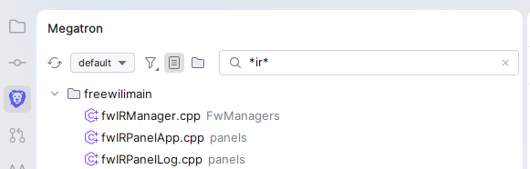

#  Megatron Project Browser

*Written in Detroit, this is a project browser for the CLions. Not as amazing as the player Calvin, but it aspires to be.*

A filtered project-files tool window for [CLion](https://www.jetbrains.com/clion/): instead of everything on disk, you see a curated tree — driven by wildcard filter sets, optional virtual folders, and a live quick filter — with build output and VCS noise pruned away.



## Install

**[⬇ Download the latest release](https://github.com/evaderkrub/Megatron-Project-Browser-for-the-CLions/releases/latest)** — grab the `clionprojectview-<version>.zip` asset (or build it yourself, below), then in CLion:

**Settings → Plugins → ⚙ → Install Plugin from Disk…** → pick the zip → restart.

The **Megatron** tool window appears on the left stripe (blue lion icon). It roots at the directory you opened the project from.

## The toolbar, left to right

| Control | What it does |
|---|---|
| **🔖 Add Bookmark** | Inserts a bookmark comment above the caret line of the active editor — `// megatron/<active set>: ""` (`#` in CMake files) — and puts the caret between the quotes so you type the title in place. Disabled when no editor is open. |
| **`<set name>` ▾** (combo button) | Shows the **active config set** and switches between sets. Ends with **New Set…**, which asks for a name, creates `megatron/<name>.filters` + `<name>.folders` from documented templates, switches to it, and opens both files for editing. |
| **Funnel dropdown** | Filter toggles: **Only CMake Project Files** (pinned first — when on, only files that belong to the loaded CMake project model are shown; a no-op until CMake finishes loading) and one checkbox per **filter group** from the active set's `.filters` file. A file is visible if it matches ANY pattern of ANY enabled group. Ends with **Edit Filters…**, which opens the active set's `.filters` file for editing. |
| **☰ Flat View** | Shows all visible files as one flat, name-sorted list with grey relative paths instead of a directory tree. |
| **📁 Folder View** | Shows your **virtual folders** (from the active set's `.folders` file) plus an `<Unassigned>` bucket holding the normal tree minus assigned files. Mutually exclusive with Flat View; both off = plain tree. |
| **Filter results…** (text box) | The **quick filter** — a final, transient narrowing on top of everything else, live as you type (300 ms debounce). Bare text like `wow` means *name contains* (`*wow*`); text with `*`, `?`, or `/` is a glob (`*.h`, `src/**`). The ✕ clears it; it resets on restart. |

When no config sets exist yet, a banner appears above the tree: **"No Megatron config sets — Create default set"**. Clicking it creates a documented `megatron/default.filters` + `default.folders` pair and opens them.

## Opening files

- **Double-click** (or **Enter**) a file — opens it in the editor.
- **Ctrl + double-click** a file — opens it *and* its header/source counterpart (`foo.cpp` ↔ `foo.h`; same base name across `c/cc/cpp/cxx` ↔ `h/hh/hpp/hxx`, preferring the same directory). Falls back to a plain open when no counterpart exists. The counterpart search deliberately ignores filters and the CMake gate — headers missing from `CMakeLists.txt` are still found.

## Bookmarks

A bookmark is a plain comment in your code:

```cpp
// megatron: "fix this overflow"          ← shown in every config set
// megatron/default: "wire up the panel"  ← shown only when the 'default' set is active
```

(`# megatron: "..."` in CMake files.) The **🔖 Add Bookmark** toolbar button inserts one above the caret line, pre-stamped with the active set, caret between the quotes.

All bookmarks in filter-visible files appear under a **Bookmarks** node pinned at the bottom of the tree (hidden when there are none), titled by the quoted text with a grey `path:line`. Double-click or Enter jumps to the line. To delete or edit a bookmark, edit the comment. Bookmarks in files hidden by the current filters (or quick filter, or CMake gate) don't appear.

The whole feature can be switched off with the **Comment Bookmarks** toggle in the funnel dropdown: the Bookmarks node disappears, file scanning stops, and the 🔖 button is disabled.

## Right-click menu

On **files**:

| Entry | What it does |
|---|---|
| **Add to Folder ▸** | Assigns the selected file(s) to a virtual folder (submenu of existing folders + **New Folder…**). Available in every view mode. |
| **Remove from Folder** | Unassigns the selected file(s) — shown only when at least one is currently in a folder (writes a `!` exclusion when a pattern would otherwise reclaim it). |
| **Open Pair** | Opens the file and its header/source counterpart. Shown only when a counterpart exists. |
| **Reveal in Explorer** | Opens the OS file manager at the file (label is OS-appropriate). |

On **folders** (virtual folders, disk directories, and `<Unassigned>`):

| Entry | What it does |
|---|---|
| **Open in Tabs** | Opens every visible file underneath, recursively. Asks for confirmation above 20 files. |
| **Open in Pinned Tabs** | Same, but pins each tab. |
| **New Folder… / New Subfolder…** | Creates virtual folders (Folder View only). |
| **Rename… / Delete** | Renames a virtual folder (subfolders and assignments follow) or deletes it (its files return to `<Unassigned>`). |

On **anything** (always shown, last entry):

| Entry | What it does |
|---|---|
| **Refresh** | Forces a VFS refresh and rebuilds the tree. Rarely needed — the tree auto-refreshes when relevant files change. |

**Drag and drop** (Folder View): drag one or more files onto a virtual folder to assign them, onto `<Unassigned>` to unassign.

## Configuration: the `megatron/` directory

All config lives in a `megatron/` directory at the project root. A **set** is a pair of files sharing a base name — `megatron/<set>.filters` and `megatron/<set>.folders` — and you switch sets from the toolbar combo. Either file may be absent (no `.filters` → built-in C/C++/CMake defaults; no `.folders` → plain tree in Folder View). The files are plain text, VCS-friendly, and hand-editable — the tree updates within about a second of any edit.

### `<set>.filters` — what is shown

```
# One group per line.  Toggle groups from the funnel dropdown.
Sources: *.c, *.cc, *.cpp, *.cxx, *.h, *.hh, *.hpp, *.hxx, *.inl, CMakeLists.txt, *.cmake
Docs: *.md, docs/**
```

- `Name: pattern, pattern, …` — a file is visible if it matches any pattern of any enabled group.
- Pattern rules (case-insensitive): `*` matches within one path segment, `?` one character, `**` crosses directories. A pattern containing `/` matches the project-relative path; without `/` it matches the file name only.
- No groups (or all toggled off) → the built-in defaults apply.

### `<set>.folders` — virtual folders

```
# Comment header — preserved even when the UI rewrites this file.
Core/
  src/engine.cpp        exact file
  src/**                glob pattern: auto-assigns matching files
  !src/generated.cpp    exclusion: keeps a file out of pattern matches
Core/Math/
  *matrix*
Platform/
```

- Lines ending `/` declare folders; nest with `Core/Math/` (parents auto-create).
- Other lines assign files to the folder above them: exact project-relative paths, glob patterns, or `!` exclusions.
- **Precedence per file:** exact entry beats exclusions, exclusions beat patterns, and among patterns the one *latest in the file* wins. One folder per file.
- Unclaimed files appear under `<Unassigned>` in Folder View.
- UI edits (menu, drag-and-drop) rewrite the file but keep the leading comment header. Order matters (pattern precedence), so folders serialize in declaration order.
- Known limitation: there is no escape syntax — a real file literally named with a leading `!` or containing `*`/`?` would parse as a rule.

## Behavior notes

- **Auto-refresh:** file create/delete/rename/move events under the project root refresh the tree (debounced); content edits don't, except edits to `megatron/` config files, which always do.
- **Noise pruning:** `.git`, `.idea`, `build`, `out`, `.vs`, and `cmake-build-*` directories are never shown or traversed.
- **Everything is case-insensitive:** patterns, paths, folder and set names.
- Directories appear only when something visible is inside them.
- Group on/off toggles, the active set, and view mode persist per-user in the IDE workspace (not in the shared files).

## Building from source

Requires JDK 21 (Temurin). From the repo root:

```
gradlew.bat buildPlugin      # produces build/distributions/clionprojectview-<version>.zip
gradlew.bat test             # full test suite
gradlew.bat runIde           # launches a sandbox CLion with the plugin
```

Targets CLion 2026.1 (`sinceBuild=261`), Kotlin 2.3, IntelliJ Platform Gradle Plugin 2.18.

## License

[MIT](LICENSE) © 2026 Dave Robins
